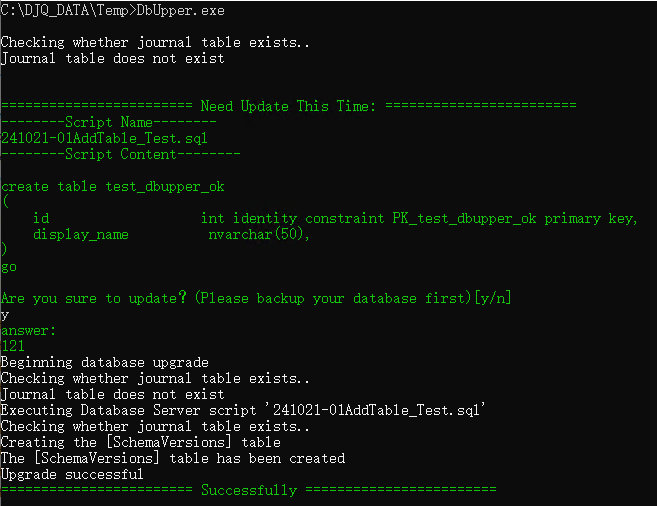

English | [中文](https://github.com/JunqiaoDuan/JInv/blob/main/DbUpper/docs/README-CN.md)


**DbUpper**  is a minimal implementation based on [DbUp ](https://github.com/DbUp/DbUp) that allows you to fully utilize the core functionalities of DbUp with just the most basic configuration, simplifying the development process. It is a best practice for a DbUp Console application.


## How to Get Started


**Step 1:  Configure Data**

Modify the configuration file appsettings.json

```
-- -- Whether to create the database if it does not exist (the user must have master privileges)
"CreateDbIfNotExist": true,
-- Database connection string
"DbConnStr": "Server=.;Initial Catalog=TestDbUpper;User ID=sa;Password=123qwe;TrustServerCertificate=True"
```


**Step 2: Add Scripts**

Add the required scripts under the Scripts folder.


**Step3: Start the Application**

Run DbUpper.


**Step 4: Execute the Scripts**

Check the current scripts waiting to be executed and enter 'y' to confirm execution.




## Integration into CICD

Here is how to integrate DbUpper into your CICD pipeline using PowerShell.

**Execute Scripts, Default Input 'y'**

```
-- First, switch the PowerShell path to:.\src\DbUpper\DbUpper
echo y | dotnet run DbUpper.csproj
```
