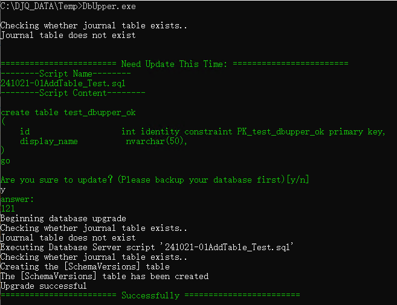

[English ](https://github.com/JunqiaoDuan/JInv/blob/main/DbUpper/README.md) | 中文


**DbUpper** 是基于[DbUp](https://github.com/DbUp/DbUp)开箱即用的一个最小实现，只需要最基本的配置，就可以完整的使用DbUp的核心功能，简化开发流程。是一个DbUp Console应用的最佳实践。


## 如何启动


**Step1 配置数据**

修改配置文件appsettings.json

```
-- 如果数据库不存在，是否运行创建数据库（用户需要有master权限）
"CreateDbIfNotExist": true,
-- 数据库连接字符串
"DbConnStr": "Server=.;Initial Catalog=TestDbUpper;User ID=sa;Password=123qwe;TrustServerCertificate=True"
```


**Step2 添加脚本**

在Scripts文件夹下面，添加需要的脚本


**Step3 启动应用**

执行DbUpper


**Step4 执行脚本**

查看当前待执行的脚本，并输入y确认执行




## 集成到CICD

介绍一下，如何在CICD中，通过PowerShell，集成DbUpper

**执行脚本，默认输入y**

```
-- 先将PowerShell路径切换到：.\src\DbUpper\DbUpper
echo y | dotnet run DbUpper.csproj
```

